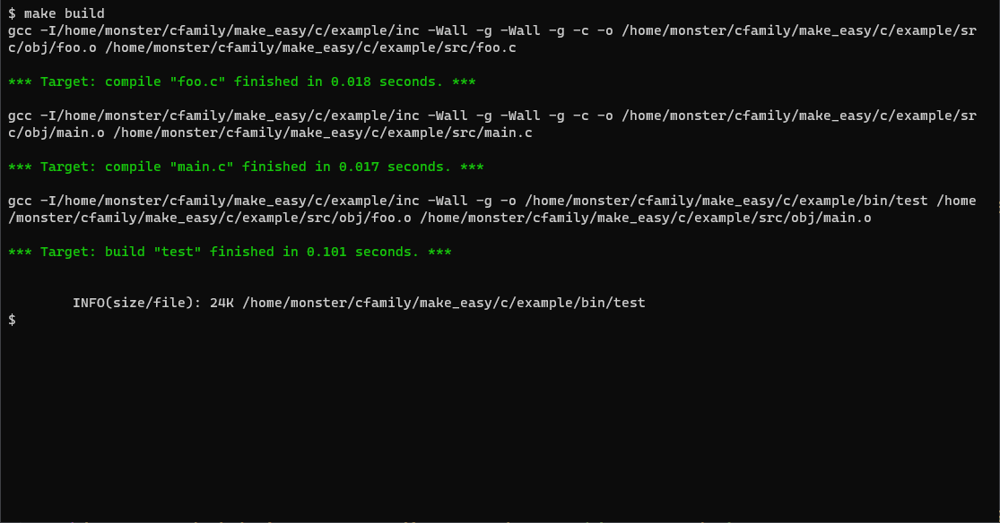
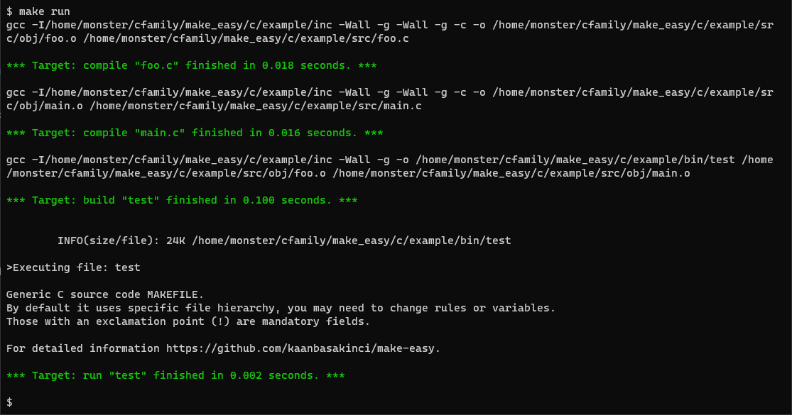
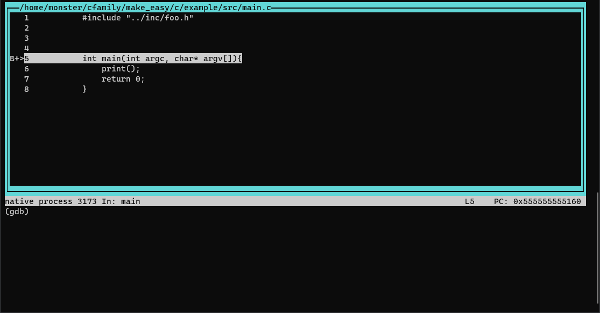
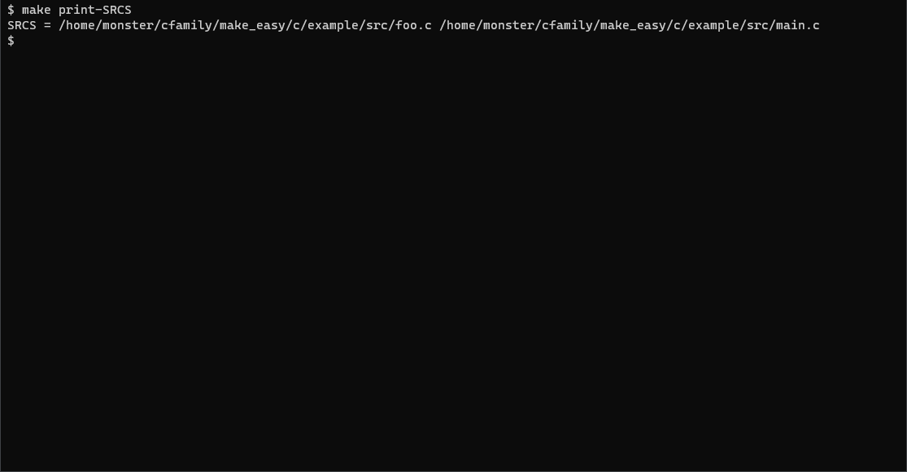

# Make Easy
Don't be fooled by the Make Easy naming, it's not an executable or a program. I was just looking for a title with "make" in it and not the same name as other projects. I just wrote a Makefile. The Makefile I wrote contains rules that will make the developer's job easier.
The main titles of the features are:
- Compiles C/C++ source files.
- Generates executable file.
- It has a super minimal gdb integration.

### Table of Contents 


- [Make Easy](#make-easy)
    - [Table of Contents](#table-of-contents)
  - [Introduction](#introduction)
  - [Motivation](#motivation)
  - [Limits](#limits)
  - [How to use](#how-to-use)
  - [Install Prerequisites](#install-prerequisites)
  - [How to Install](#how-to-install)

## Introduction
I will repeat Make Easy is not a program. What they can do is limited to what a Makefile, or rather the GNU Make tool, can do. Don't have high expectations.

It is a Makefile written for C/C++, butits purpose is to make it suitable forevery project by making very minorchanges on the template. It has adefaults file hierarchy of my choosing.The default file hierarchy will bementioned. The default file hierarchycan be adapted to another project withvery minor changes. I tried to explainas much as I could in the Makefile, besure to pay attention to the commentlines in the Makefile.


In the default and my favorite file hierarchy:\
Makefile is located just below the project file. This is because I can get directories more easily in Makefile. Then the files are foldered according to their type. There are three main folders and one subfolder.

Default Folders:

- `bin`: Abbreviation for binary. The executable file of the project is located here.
- `inc`: Abbreviation of include. Libraries are located in this folder.
- `src`: Abbreviation for the source. object folder and source files are located here.
- `src/obj`: Abbreviation for the object. Object files are located here.

Representation of the default file hierarchy for a program that print Make Easy intro which can be found in examples.

C project default file hierarchy:
```
 ├── bin 
 |    ├── test
 ├── inc
 |    └── foo.h
 ├── src
 |    ├── foo.c
 |    ├── main.c
 |    └── obj
 |         ├── foo.o
 |         └── main.o
 └──  Makefile
```
C++ project default file hierarchy:

```
 ├── bin 
 |    ├── test
 ├── inc
 |    └── foo.hpp
 ├── src
 |    ├── foo.cpp
 |    ├── main.cpp
 |    └── obj
 |         ├── foo.o
 |         └── main.o
 └──  Makefile
```

* After finding the directory where Makefile is located, it determines the other directories. 
* It compiles every source file inside the src folder. 
* It can delete all or just object files of the build results. 
* It can compile and run the program. 
* Run the executable in the gdb tool (with its parameters, if any, must be populated in the Makefile) and stop the program at the entry point.
* The debug file can also be deleted. 
* Any variable in the Makefile can be printed.
* It measures the time elapsed separately in the build process, the build process, and the run process. 
* If an error is encountered while measuring time, the leftover file remains. It doesn't matter, it'll take care of it at the next session. However, if it is annoying, there is a rule that deletes it manually.

## Motivation
When I started learning Makefile, I felt that writing a Makefile for the project was more daunting than the project. From the very beginning I searched for an easier way, but it was already in the Makefile.

As I continued to search on the Internet, I saw projects that handle almost every process with Makefile. I wanted to create a beautiful and project-independent Makefile and use it in all projects. Of course you can't use it in every project right now, but you understand what I mean.

I looked at more Makefiles on the internet and decided what I needed to add more. I liked the result and wanted to share.

## Limits 
- Default tool GNU Make accepted.
- Linux terminal commands used.
- 3rd party libraries are not handled.
- GDB is used for debug.

## How to use
First download/copy the Makefile and place it in the project folder. If it will not be used in the default hierarchy, change the directory and file variables according to the file hierarchy of the project. Although every variable in the file can be changed. 

The variables `TARGET` and `CFLAGS` (or `CXXFLAGS`) must be assigned. (In the absence of the FLAGS variants there is no logical problem, but it has not been tested.)

MAKE_DIR: Makefile directory. we can also branch the project path for the file without tiring the developer.

`SRC_DIR`: Source folder directory.

`OBJ_DIR`: Object folder directory.

`INC_DIR`: Include(library) folder directory.

`BIN_DIR`: Binary (TARGET) folder directory.

`INC`: Include parameter contains gnu make argument.

`TARGET`: Executable file name.

`CFLAGS`: Compiler flags. (recomend to add)

`DEBUG_DIR`: Debug folder directory.

`DEBUG`: Debug file, contains commands for gdb tool.

`DEBUG_ARGS`: Program arguments for project program (TARGET). 

`SRCS`: All source files in project.

`OBJS`: All objects files generated from GNU Make.

Makefile requires special command selection to run, so the classic "make" command only displays usage information. There are different commands in the Makefile.

```
make build
```
It compiles and links, the executable file is produced.



```
make run
```
It compiles and links, the executable file is produced and execute executable file.



```
 make debug
```
It compiles and links, the executable file is produced and execute executable file in gdb tool. Debug session start from application entry (main).



```
make clean-leftover
```
If there is any error in the compilation process, the leftover files remains. No need but for manual cleaning.

```
make clean-obj
```
Removes object files
```
make clean build
```
Removes all files resulting from compilation and linking.
```
make clean-debug
```
Removes the settings made for debug operation.

```
make print-[VARIABLE_NAME]
```
It was put in order to be able to observe where the error is in case of an error in the Makefile file. Use it to print the desired variable. Example: make print-SCRS.



## Install Prerequisites

Makefile tries to use GNU Compiler Collection and GDB. So these two software are required.

- [GNU Compiler Collection](https://gcc.gnu.org/)
- [GNU Make](https://www.gnu.org/software/make/)
- The libraries required to develop C/C++ need to be downloaded. The nomenclature may vary from distribution to distribution.
 
## How to Install
* Download or copy content of the Makefile, place it under project folder.
* Modify Makefile for your project or fill Target and flag variable. 
* Start using.